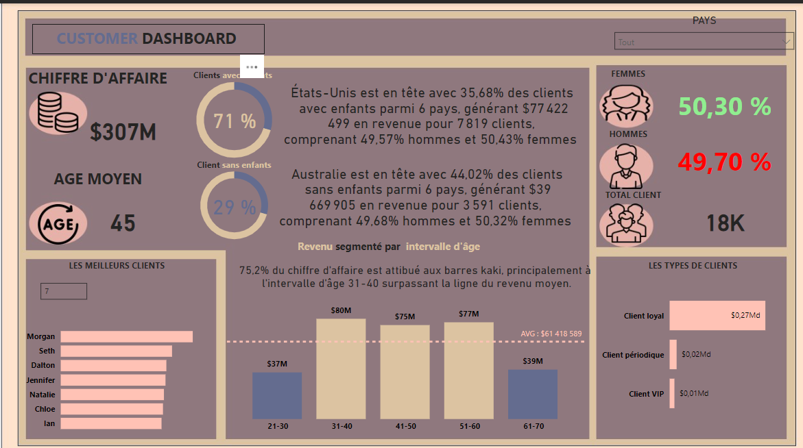

# Customer Dashboard / Tableau de bord client

The dashboard provides an overview of key business metrics, including total revenue, average age, and the percentage of male and female clients. It features pie charts showing the proportion of clients with and without children, along with total client count. Additionally, it highlights the top-performing clients, income distribution segmented by age intervals, and the distribution of client types, offering valuable insights into customer demographics and behavior.

Le tableau de bord fournit un aperçu des principaux indicateurs commerciaux, notamment le chiffre d'affaires total, l'âge moyen et le pourcentage de clients masculins et féminins. Il inclut des diagrammes circulaires montrant la proportion de clients avec et sans enfants, ainsi que le nombre total de clients. De plus, il met en évidence les meilleurs clients, la distribution des revenus segmentée par tranche d'âge et la répartition des types de clients, offrant des insights précieux sur la démographie et le comportement des clients.

